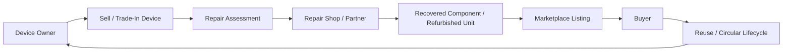
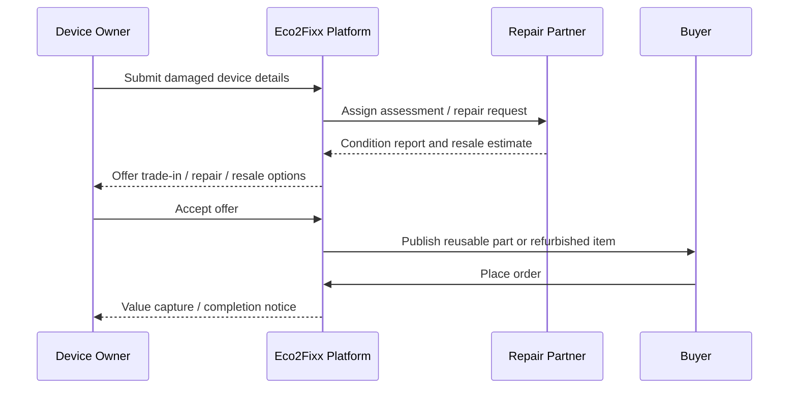
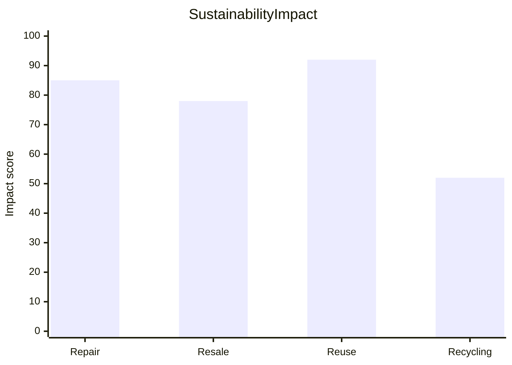

# Eco2Fixx

Eco2Fixx is a circular electronics marketplace that connects damaged-device owners, trusted repair partners, and buyers of reusable components. The platform is designed to extend the life of electronics, reduce waste, and make circular commerce easier, more transparent, and more scalable.

## Why Eco2Fixx

Electronic waste is growing faster than recycling systems can keep up. Most devices are discarded too early, even when the issue is small or the hardware is still valuable. Eco2Fixx addresses this by creating a closed-loop ecosystem where:

- owners can sell damaged or end-of-life devices
- repair partners can assess, restore, and resell value
- buyers can discover affordable reusable components and refurbished products
- the system encourages reuse over disposal

## Product vision

Eco2Fixx helps build a sustainable electronics economy by turning device waste into usable inventory, repair opportunities, and new customer value.

## Core user journeys

### 1. Device owners
- assess device condition
- choose repair, trade-in, or resale options
- receive transparent pricing and updated tracking

### 2. Repair partners
- manage repair workflows and operations
- review device intake and diagnostics
- monitor recovered components and marketplace listings

### 3. Buyers
- browse verified refurbished goods and reusable parts
- compare pricing and financing options
- complete secure checkout with trust signals

## Platform experience

- landing page with circular economy positioning
- seller and buyer journey flow
- repair partner dashboard
- product marketplace and checkout experience
- EMI and financing support
- trust, safety, and circularity storytelling

## Business model

Eco2Fixx supports a circular commerce model built around multiple revenue streams:

- device buyback and trade-in value capture
- repair and refurbishment service fees
- marketplace commissions on resale transactions
- component and accessory monetization
- financing and EMI-enabled purchase support

## System overview



## Transaction flow



## Circular economy impact



## Product status

The current version includes:

- responsive landing-page experience
- customer marketplace screens
- partner dashboard flow
- trust and safety UI
- checkout and financing UI blocks
- circular economy storytelling and conversion-driven sections

## Tech stack

- React
- TypeScript
- Vite
- CSS and component-driven UI
- JavaScript ecosystem tooling

## Project structure

```text
Eco2Fixx/
├── src/
│   ├── components/
│   ├── data/
│   ├── assets/
│   ├── types/
│   ├── App.tsx
│   ├── main.tsx
│   └── index.css
├── index.html
├── metadata.json
├── package.json
├── package-lock.json
├── vite.config.ts
├── tsconfig.json
├── .env.example
├── README.md
├── docs/
│   ├── architecture.md
│   └── roadmap.md
└── dist/
```

## Getting started

### Prerequisites

- Node.js 18 or later
- npm

### Install dependencies

```bash
npm install
```

### Run the app locally

```bash
npm run dev
```

### Production build

```bash
npm run build
```

### Preview production build

```bash
npm run preview
```

## Scripts

```bash
npm run dev
npm run build
npm run preview
npm run lint
```

## Roadmap

### Near-term
- improve data flow between device intake and repair workflow
- add authentication and role-based dashboards
- enhance marketplace product filters and sorting
- connect real backend data and payments

### Future
- AI-based device condition assessment
- automated repair estimation and pricing engine
- logistics and pickup coordination
- sustainability impact analytics dashboard

## License

This project is intended for portfolio, concept validation, and demo use unless otherwise specified by the owner.

## Notes

Eco2Fixx is positioned as a sustainable electronics commerce concept that blends product design, operations, and circular business thinking into a compelling user experience.

For additional product details and diagrams, see the documentation in the docs folder.
