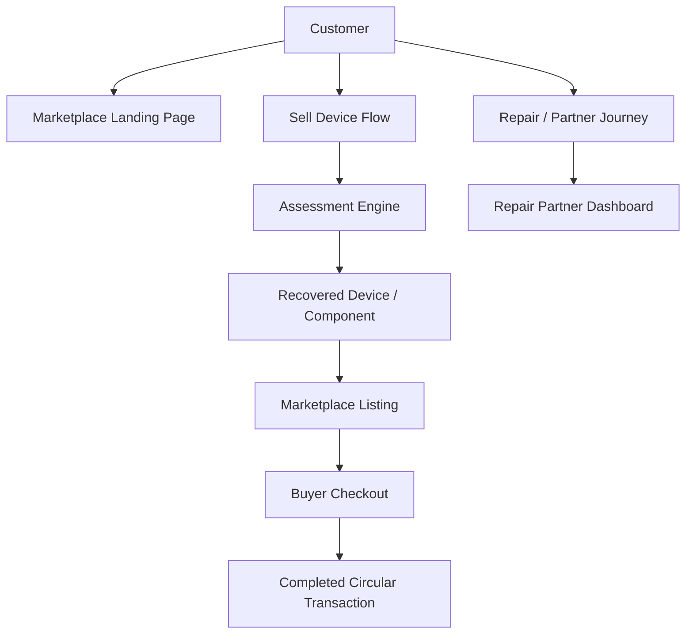
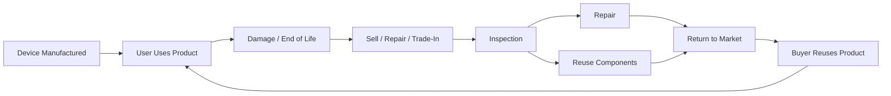
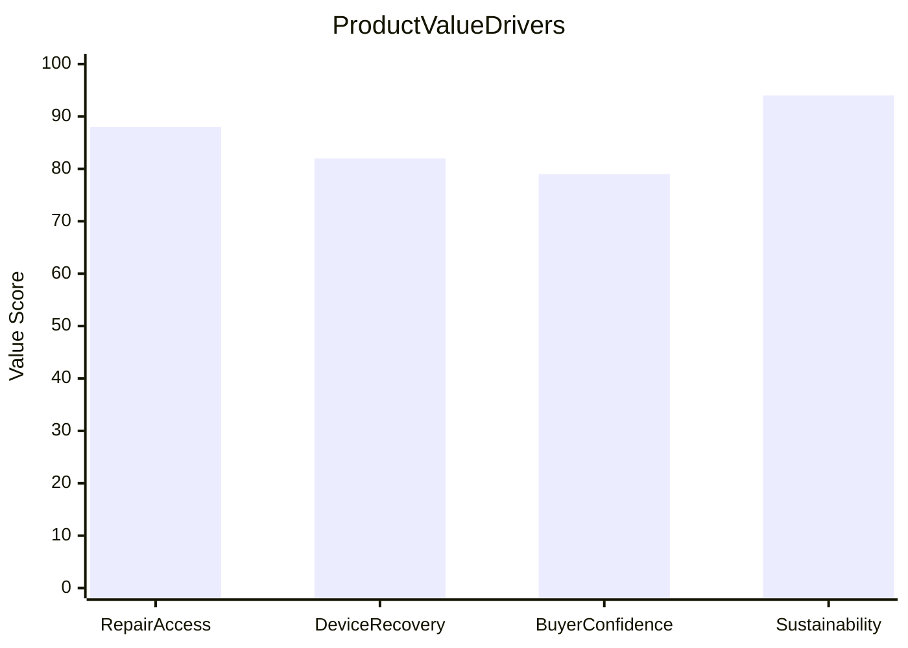

# Eco2Fixx Architecture and Flow

## System context

## Circular lifecycle model

## Impact and business value

## User and business roles

- Device owners: sell or trade in damaged electronics
- Repair partners: assess and restore devices for reuse
- Buyers: purchase refurbished or reusable items
- Platform operator: manage trust, commerce, and marketplace quality

## Recommended next-stage architecture

- frontend: React + TypeScript app
- data layer: mock datasets and future API integration
- backend services: device intake, repair workflows, and marketplace listings
- payments: checkout + EMI support
- analytics: usage, device recovery, and sustainability reporting

## Suggested roadmap

1. Connect local mock data to real API services
2. Add authentication and role-based dashboards
3. Create repair workflow and admin analytics dashboards
4. Add financing and payment flow integration
5. Introduce AI-driven condition assessment and pricing
